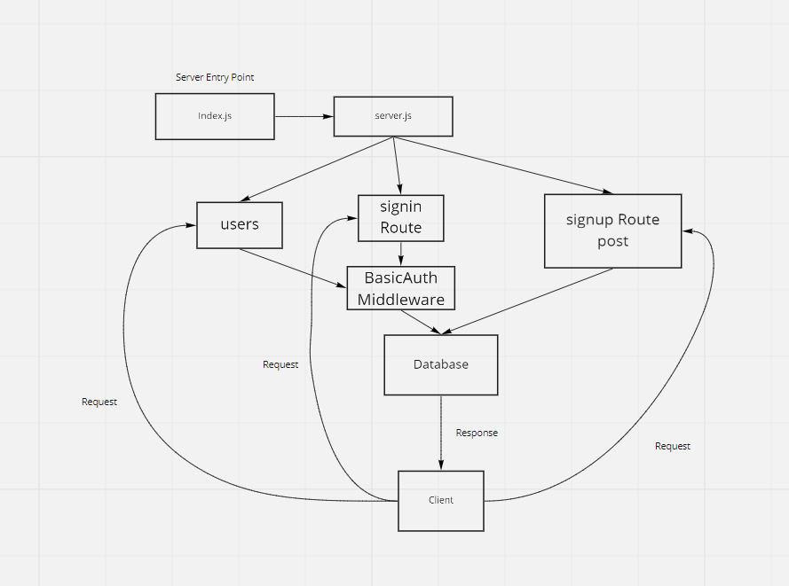

# bearer-auth

Created by Anthony Morton

## Installation
Express, jest, dotenv, supertest, nodemon, pg, sequelize, sequelize-cli, sqlite3, base-64, bcrypt, cors, jsonwebtoken, morgan

## Summary of Problem Domain
At this point, our auth-server is able to allow a user to create an account as well as to handle Basic Authentication (user provides a username + password). When a “good” login happens, the user is considered to be “authenticated” and our auth-server generates a JWT signed “Token” which is returned to the application

We will now be using that Token to re-authenticate users to shield access to any route that requires a valid login to access.

## Links to application deployment
signin: https://auth-bearer-anthony-morton.herokuapp.com/signin
signup: https://auth-bearer-anthony-morton.herokuapp.com/signup
secret: https://auth-bearer-anthony-morton.herokuapp.com/secret
pull: https://github.com/anthonylouismorton/bearer-auth/pull/2
actions: https://github.com/anthonylouismorton/bearer-auth/actions

## Include embedded UML

## Talk about your routes

## Routes

* HTTP POST
  * Path: /Signin
    * validates user using basic auth

    * HTTP POST
  * Path: /Signup
    * Creates new username/password in db

        * HTTP GET
  * Path: /users
    * Gets all users in db using BearerAuth middleware
